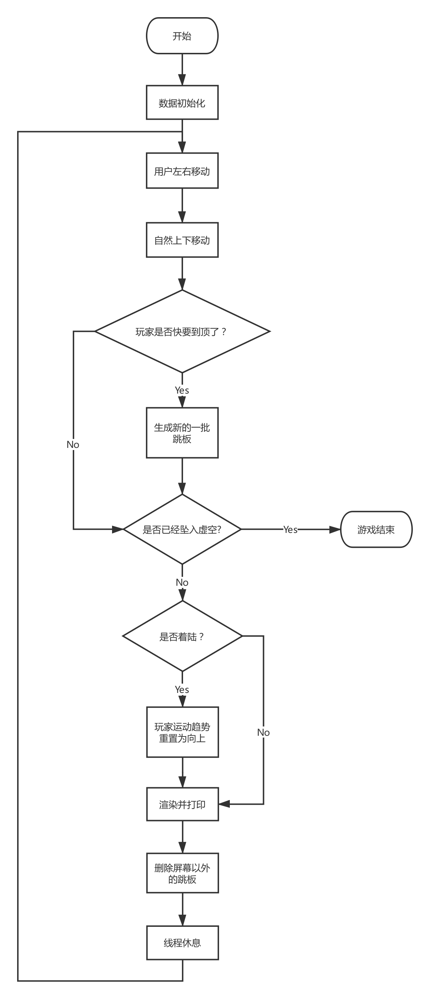

# 整体设计

游戏分为前端渲染和后端控制两大模块，两者通过标准的数据接口连接。前后端分离将有助于协同开发、分模块调试以及模块单独升级优化。

游戏过程中每一帧都会进行如下操作：

前端按键捕获 -> 后端数据处理 -> 前端渲染 -> 前端打印输出


约定：

- 函数命名均为

```C
type verb_noun(int, char, struct others*, struct setting*)
```

- 变量命名
  - 均使用单数


## 流程图

